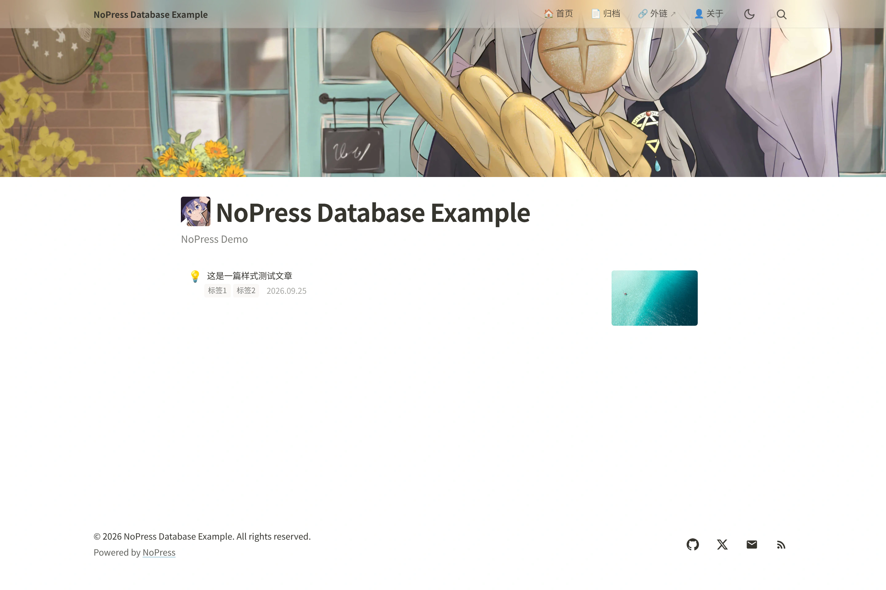
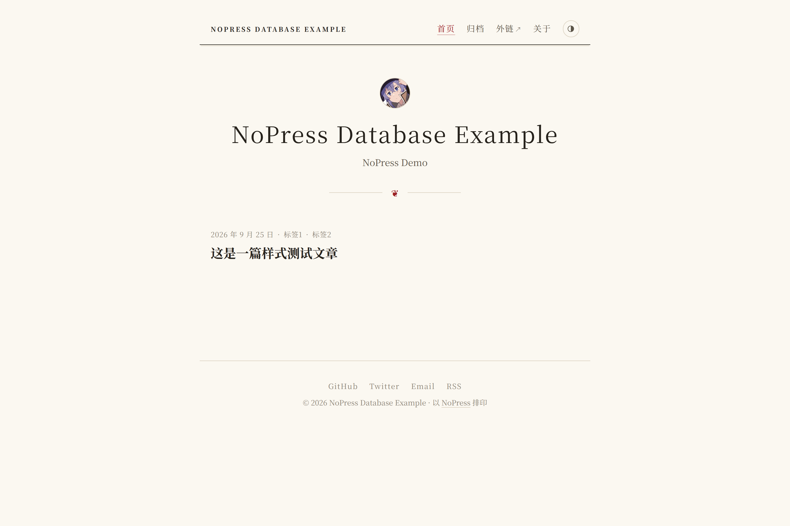
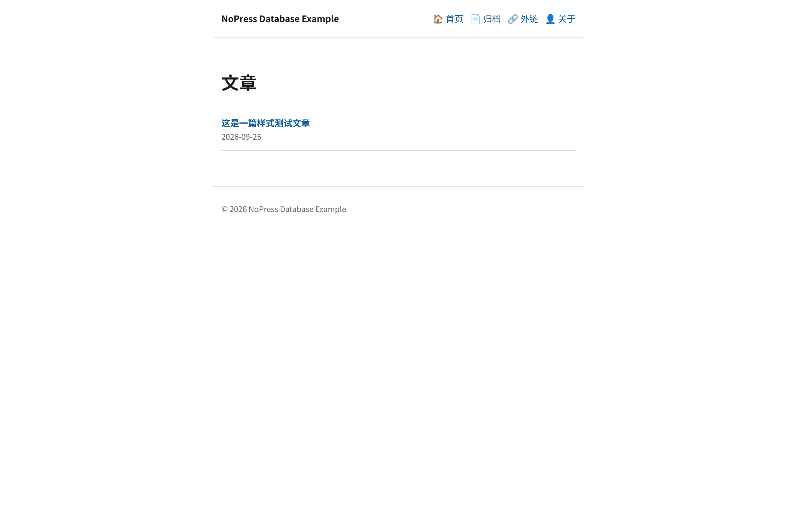
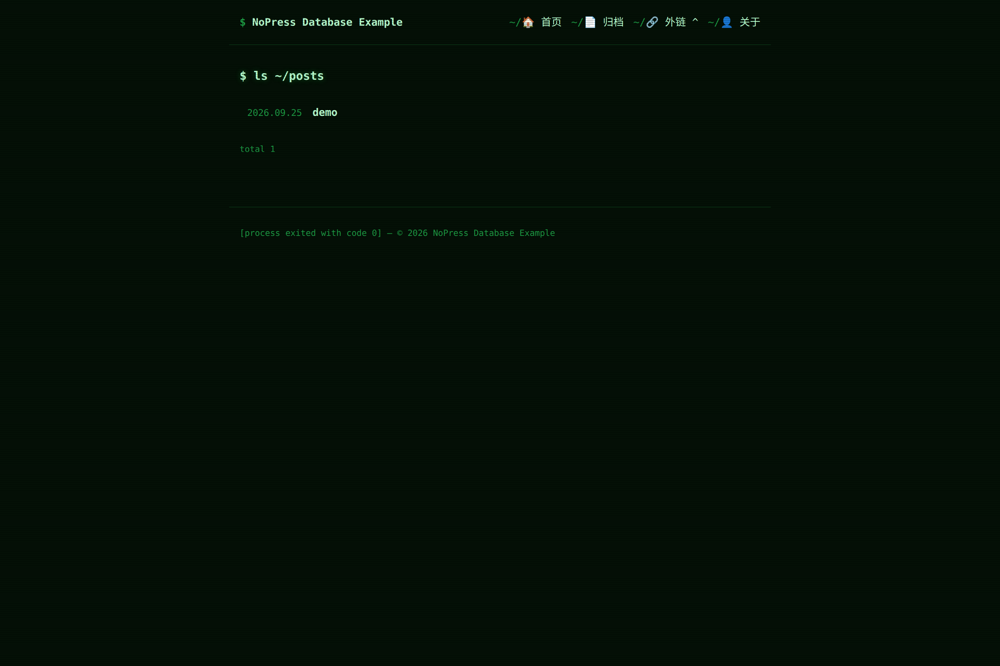
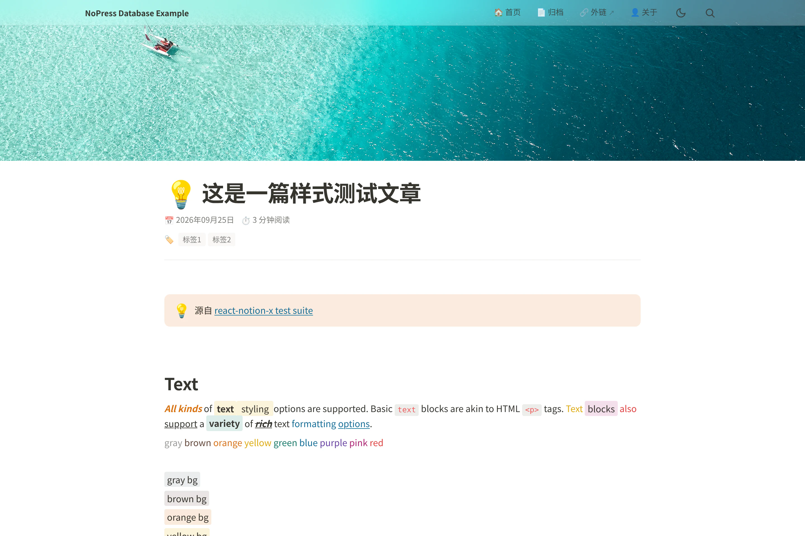
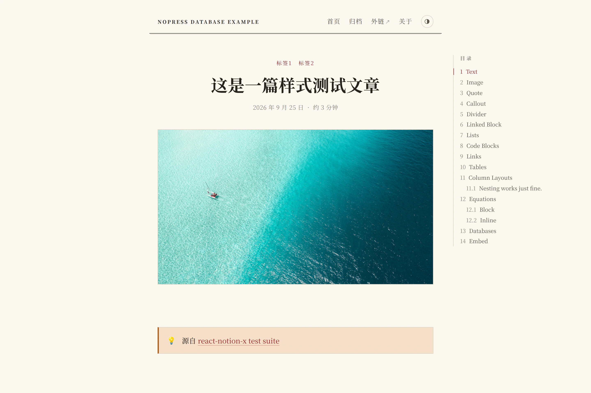
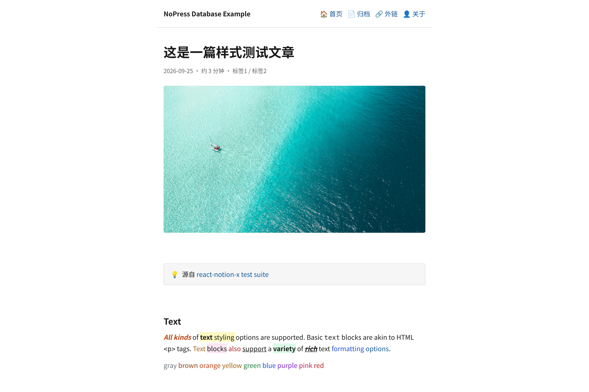
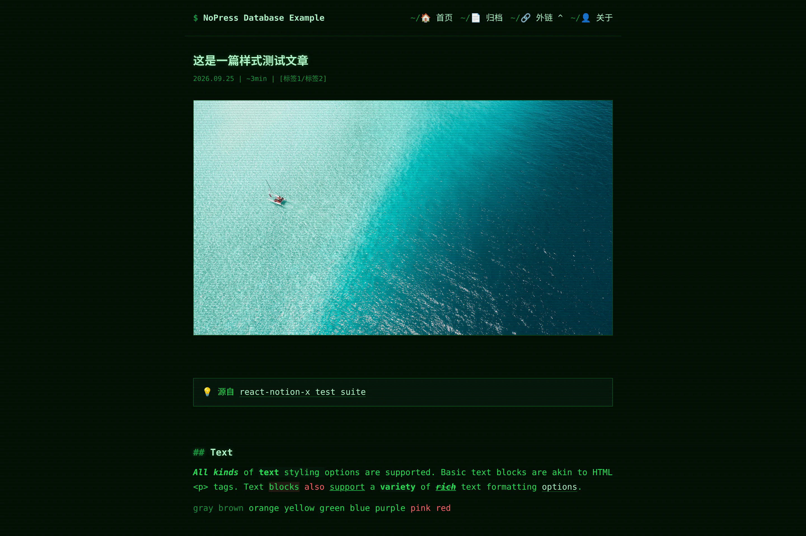

# NoPress 用户指南

## 一、搭好你的博客

### 第 1 步：准备 Notion

1. **复制内容数据库**：打开 [Example Database](https://xxuuu.notion.site/a6d887563979827fb7d601c96daa2b11)，点右上角 **Duplicate** 复制到自己的工作区；也可以手动新建 Database 并添加这些列（**列名必须全部小写**）：

   | 列名 | 类型 | 说明 |
   |------|------|------|
   | title | Title | 文章标题 |
   | type | Select | 填 `Post`（文章）/ `Page`（独立页面）/ `Menu`（导航菜单） |
   | status | Select | 填 `Published` 才会显示，`Draft` 不显示 |
   | slug | Text | 链接地址，如 `hello-world` |
   | summary | Text | 摘要 |
   | date | Date | 发布日期 |
   | tags | Multi-select | 标签（可选） |

2. **复制 Database ID**：用浏览器打开这个 Database 页面，从地址栏复制：

   ```
   https://www.notion.so/workspace/{database_id}
                                    ^^^^^^^^^^^^
   ```

3. **创建 Integration Token**：

   1. 打开 [Notion Integrations](https://www.notion.so/my-integrations)，点 **+ New integration**
   2. **内容访问权限**里选择第 1 步的 Database 页面（也可以之后再在 Database 页面右上角 **··· → Connections** 里添加）
   3. 提交后复制页面上显示的 **Token**（`secret_` 或 `ntn_` 开头）

   不做这一步的话，博客读不到 Database 里的内容。

4. **将博客 Database 发布到 Web**：打开 Database 页面，点右上角 **Share → Publish → Publish**，并确认公开页面无需登录 Notion 即可访问。Integration 授权只供构建时读取内容；博客访客需要通过公开页面访问 Notion 托管的图片。

   > **隐私提醒**：发布页面时，Notion 默认也会发布其子页面。Database 中标记为 `Draft` 的条目仍可能通过 Notion 公开页面直接访问，即使它们不会显示在 NoPress 博客中。发布前请移出不应公开的页面，或在 Notion 中限制这些子页面的公开访问。详见 [Notion 网页发布说明](https://www.notion.com/help/public-pages-and-web-publishing)。

### 第 2 步：部署

1. 把 [NoPress 仓库](https://github.com/xxxuuu/nopress) **Fork** 到你的 GitHub 账号（或用 Use this template）
2. 打开 [Vercel](https://vercel.com)（免费），**Add New → Project**，导入你刚 Fork 的仓库
3. 在 **Environment Variables** 里添加两条：

   | 名称 | 值 |
   |------|-----|
   | `NOTION_TOKEN` | 第 1 步复制的 Token |
   | `NOTION_DATABASE_ID` | 第 1 步复制的 Database ID |

4. 点 **Deploy**，几十秒后你的博客就上线了

Netlify 等其它平台同理：导入仓库 + 配这两个变量即可。

## 二、日常写作

**写博客 = 在 Notion Database 里加一行 + 写页面内容**，然后执行部署（也可以配置成自动部署，见[第五章](#五可选notion-更新自动部署)）。

| 我想…… | 在 Notion 里怎么做 |
|---------|-------------------|
| 发文章 | 加一行：`type` 选 `Post`、`status` 选 `Published`、填好 `slug` 和 `date`，页面里正常写内容 |
| 存草稿 | `status` 选 `Draft`，博客上不会出现 |
| 改文章 | 直接改 Notion 页面内容，改完触发一次部署 |
| 加"关于"页 | 加一行 `type` 选 `Page`，`slug` 填 `about`——访问地址就是 `/about` |
| 加导航菜单 | 加一行 `type` 选 `Menu`：`slug` 填站内地址（如 `/about`）或完整网址（如 `https://github.com/你`） |

## 三、站点设置

| 我想改…… | 怎么做 |
|----------|--------|
| 站点名称 / 图标 / 描述 | 在托管平台的环境变量里设 `SITE_TITLE` / `SITE_ICON` / `SITE_DESCRIPTION`（留空则自动使用 Notion Database 的名称和图标） |
| 版权起始年份 | 环境变量 `SITE_START_YEAR`，留空仅显示当年 |
| 评论开关与配置 | 见 [评论配置指南](./COMMENTS.md) |
| 每页文章数、RSS 开关 | 环境变量 `SITE_POSTS_PER_PAGE` / `SITE_ENABLE_RSS`（完整清单见 [配置参考](./CONFIGURATION.md)） |
| 网站地址 | 环境变量 `SITE_URL`（绑定自己的域名后设置） |

## 四、换主题

在托管平台设置 `NOPRESS_THEME` 后重新部署（默认 `default`）。

| Default · 默认 | Paper · 纸本 |
| --- | --- |
| [](./assets/themes/default.webp) | [](./assets/themes/paper.webp) |
| Notion 风格、全宽封面、侧边目录。 | 衬线正文、章节编号、页边目录、BibTeX 引用。 |
| `NOPRESS_THEME=default` | `NOPRESS_THEME=paper` |
| **Minimal · 极简** | **Terminal · 终端** |
| [](./assets/themes/minimal.webp) | [](./assets/themes/terminal.webp) |
| 纯文字列表、系统字体。 | 黑底绿字、等宽字体、CRT 扫描线。 |
| `NOPRESS_THEME=minimal` | `NOPRESS_THEME=terminal` |

<details>
<summary>文章页预览</summary>

| Default · 默认 | Paper · 纸本 |
| --- | --- |
| [](./assets/themes/default-post.webp) | [](./assets/themes/paper-post.webp) |
| **Minimal · 极简** | **Terminal · 终端** |
| [](./assets/themes/minimal-post.webp) | [](./assets/themes/terminal-post.webp) |

</details>

### 主题选项

通过 `NOPRESS_THEME_OPTIONS` 设置当前主题的选项，值为 JSON：

```text
NOPRESS_THEME_OPTIONS = {"showPostCover": false, "showReadingTime": false}
```

上例用于 `default`；各主题支持的选项如下：

- **default**：`darkMode`（深色模式开关）、`showPostCover`（文章封面）、`showReadingTime`（阅读时长）
- **paper**：`darkMode`、`accentColor`（点缀色）、`numberedHeadings`（章节编号）、`showCitation`（BibTeX 引用）、`author`（引用署名）、`showPostCover`（文章封面）
- **minimal**：`darkMode`、`footerText`（页脚文字）、`showPostMeta`（文章元信息）
- **terminal**：`promptSymbol`（终端提示符符号）、`showScanlines`（扫描线质感）

选项机制见 [主题开发契约](./THEMES.md)。

## 五、（可选）Notion 更新自动部署

博客是构建时从 Notion 拉取内容生成的静态页面，改完 Notion 要重新部署才能看到效果。Notion 数据库的**自动化**功能能在数据库变动时向指定网址发通知（`发送 webhook` 操作需要 Notion 商业版或教育版），配合 Vercel 的 **Deploy Hook** 可实现文章更新自动部署。

### 第 1 步：创建 Deploy Hook

1. 打开 Vercel 项目的 **Settings → Git → Deploy Hooks**
2. NAME 填 `notion`，GIT BRANCH 填博客仓库的分支（一般是 `main`），点 **Create Hook**
3. 复制生成的网址（形如 `https://api.vercel.com/v1/integrations/deploy/…`）——它相当于部署开关，**不要公开**

### 第 2 步：在 Notion 数据库里建自动化

1. 打开内容 Database，点右上角 **⚡ → 新建自动化**
3. 点击 **添加触发器 → 属性 `status`**，值只勾选 `Published`
3. 点 **新操作 → 发送 webhook**，粘贴第 1 步的网址

此时文章将在 `status` 被改为 `Published` 时自动触发 Vercel 部署
